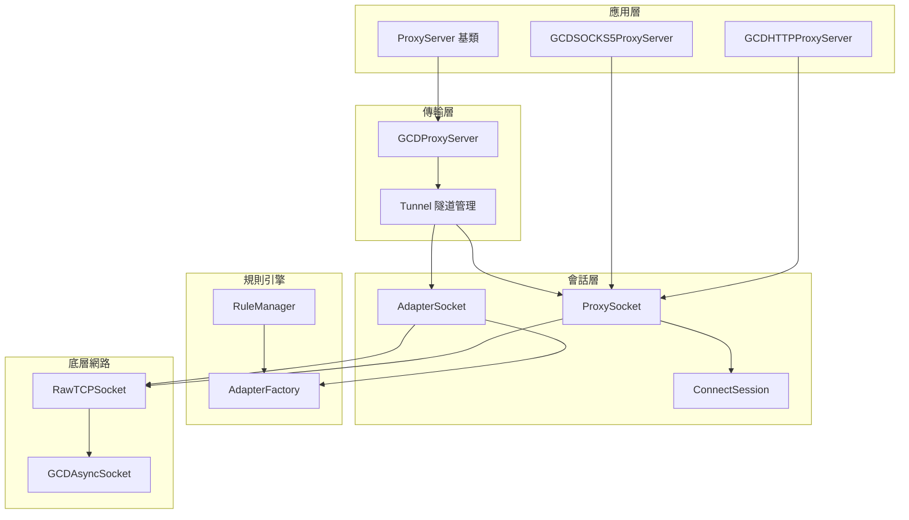
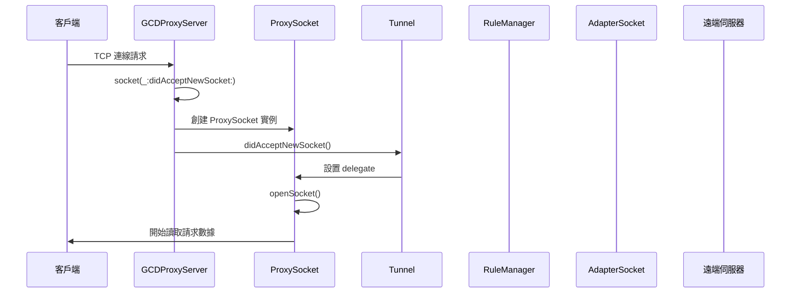
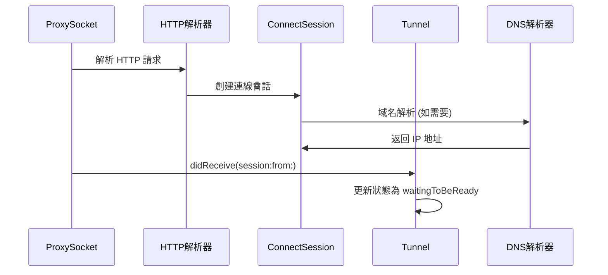
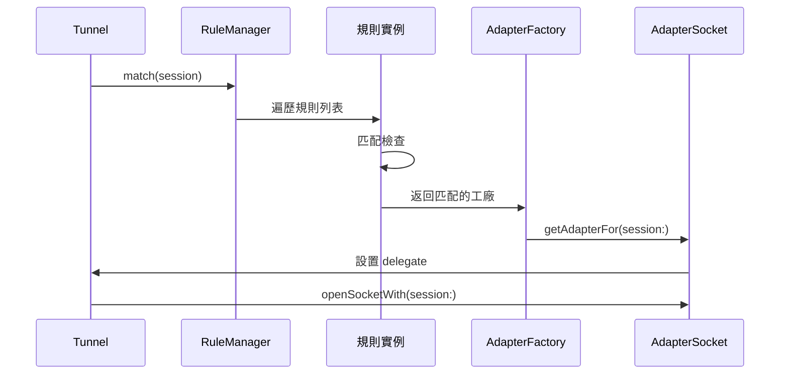
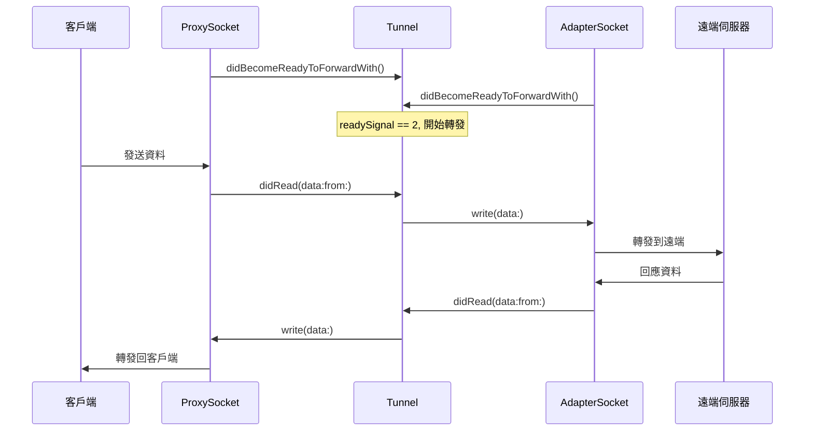
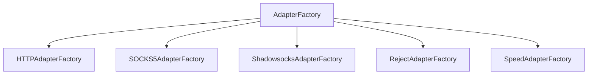
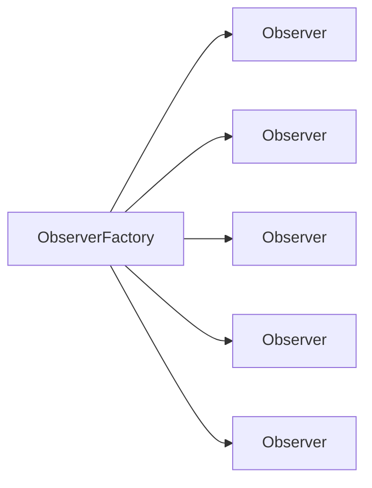

# NEKit ProxyServer 架構分析報告

## 📋 概述

NEKit 是一個用 Swift 編寫的網路工具包，提供了完整的代理服務器實現。本報告深入分析 ProxyServer 的架構設計、模組間互動關係以及完整的資料流向。

## 🏗️ 系統架構概覽

### 核心組件層次結構



### 設計模式分析

1. **委託模式 (Delegate Pattern)**
   - [`SocketDelegate`](Socket/SocketProtocol.swift:101) 處理網路事件
   - [`TunnelDelegate`](Tunnel/Tunnel.swift:4) 管理隧道生命週期

2. **工廠模式 (Factory Pattern)**
   - [`AdapterFactory`](Socket/AdapterSocket/Factory/AdapterFactory.swift:4) 創建適配器
   - [`RawSocketFactory`](RawSocket/RawSocketFactory.swift) 創建底層套接字

3. **觀察者模式 (Observer Pattern)**
   - [`Observer<ProxyServerEvent>`](Event/Event/ProxyServerEvent.swift:3) 事件通知
   - 支援調試和監控功能

4. **策略模式 (Strategy Pattern)**
   - [`Rule`](Rule/Rule.swift) 規則匹配策略
   - 不同代理協議的處理策略

## 🔄 完整資料流向分析

### 1. 客戶端連線建立流程



### 2. 請求解析與處理流程



### 3. 規則匹配與適配器選擇



### 4. 雙向資料轉發機制



## 📦 核心模組詳細分析

### ProxyServer 基類模組

**職責：**
- 定義代理服務器的基本接口
- 管理隧道集合和生命週期
- 提供事件觀察者支援

**關鍵方法：**
- [`start()`](ProxyServer/ProxyServer.swift:56): 啟動服務器，初始化觀察者
- [`stop()`](ProxyServer/ProxyServer.swift:66): 停止服務器，強制關閉所有隧道
- [`didAcceptNewSocket()`](ProxyServer/ProxyServer.swift:83): 處理新連線，創建隧道
- [`tunnelDidClose()`](ProxyServer/ProxyServer.swift:98): 清理已關閉的隧道

### GCDProxyServer 網路監聽模組

**職責：**
- 基於 GCDAsyncSocket 實現網路監聽
- 處理新連線的接受
- 提供具體代理協議的抽象基礎

**關鍵特性：**
- 使用 [`QueueFactory`](Tunnel/QueueFactory.swift) 管理執行緒佇列
- 支援指定監聽地址和埠口
- 自動處理套接字生命週期

### Tunnel 隧道管理模組

**狀態管理：**
```
invalid → readingRequest → waitingToBeReady → forwarding → closing → closed
```

**核心功能：**
- 雙向資料轉發協調
- 套接字就緒狀態同步
- 錯誤處理與恢復
- 連線生命週期管理

**關鍵屬性：**
- [`readySignal`](Tunnel/Tunnel.swift:46): 計數器，追蹤準備就緒的套接字數量
- [`isCancelled`](Tunnel/Tunnel.swift:55): 標記隧道是否已取消
- [`status`](Tunnel/Tunnel.swift:60): 當前隧道狀態

### ProxySocket 客戶端處理模組

**協議支援：**
- HTTP 代理 (CONNECT 方法和直接代理)
- SOCKS5 代理協議
- 可擴展的協議處理架構

**狀態管理：**
- 讀取狀態：[`HTTPProxyReadStatus`](Socket/ProxySocket/HTTPProxySocket.swift:4)
- 寫入狀態：[`HTTPProxyWriteStatus`](Socket/ProxySocket/HTTPProxySocket.swift:30)

### AdapterSocket 遠端連線模組

**適配器類型：**
- [`DirectAdapter`](Socket/AdapterSocket/DirectAdapter.swift): 直接連線
- [`HTTPAdapter`](Socket/AdapterSocket/HTTPAdapter.swift): HTTP 代理轉發
- [`SOCKS5Adapter`](Socket/AdapterSocket/SOCKS5Adapter.swift): SOCKS5 代理轉發
- [`ShadowsocksAdapter`](Socket/AdapterSocket/Shadowsocks/ShadowsocksAdapter.swift): Shadowsocks 協議

**工廠模式實現：**


### RuleManager 規則引擎模組

**規則類型：**
- [`AllRule`](Rule/AllRule.swift): 匹配所有請求
- [`DirectRule`](Rule/DirectRule.swift): 直接連線
- [`CountryRule`](Rule/CountryRule.swift): 基於地理位置
- [`DomainListRule`](Rule/DomainListRule.swift): 域名列表匹配
- [`IPRangeListRule`](Rule/IPRangeListRule.swift): IP 範圍匹配

**匹配流程：**
1. 遍歷規則列表
2. 調用 [`rule.match(session)`](Rule/Rule.swift) 
3. 返回匹配的 [`AdapterFactory`](Socket/AdapterSocket/Factory/AdapterFactory.swift:4)
4. 如果沒有匹配，使用預設的 [`DirectRule`](Rule/DirectRule.swift)

## 🔧 錯誤處理與連線管理

### 錯誤處理機制

**錯誤傳播路徑：**
```
底層套接字錯誤 → ProxySocket/AdapterSocket → Tunnel → ProxyServer
```

**錯誤類型處理：**
- 網路連線錯誤：自動斷開並清理資源
- 協議解析錯誤：記錄錯誤並拒絕連線
- 規則匹配失敗：使用預設直接連線

### 連線管理策略

**生命週期管理：**
1. **建立階段**: 驗證參數，初始化組件
2. **活躍階段**: 持續監控狀態，處理資料
3. **清理階段**: 優雅關閉或強制斷開

**資源回收：**
- 自動移除已關閉的隧道
- 釋放套接字資源
- 清理事件觀察者

## 📡 事件系統架構

### 事件類型分類

**服務器級事件：**
- [`ProxyServerEvent.started`](Event/Event/ProxyServerEvent.swift:17): 服務器啟動
- [`ProxyServerEvent.stopped`](Event/Event/ProxyServerEvent.swift:17): 服務器停止
- [`ProxyServerEvent.newSocketAccepted`](Event/Event/ProxyServerEvent.swift:17): 新連線接受
- [`ProxyServerEvent.tunnelClosed`](Event/Event/ProxyServerEvent.swift:17): 隧道關閉

**隧道級事件：**
- [`TunnelEvent.opened`](Event/Event/TunnelEvent.swift): 隧道開啟
- [`TunnelEvent.closed`](Event/Event/TunnelEvent.swift): 隧道關閉
- [`TunnelEvent.receivedRequest`](Event/Event/TunnelEvent.swift): 接收請求
- [`TunnelEvent.connectedToRemote`](Event/Event/TunnelEvent.swift): 連接到遠端

**套接字級事件：**
- [`ProxySocketEvent`](Event/Event/ProxySocketEvent.swift): 代理套接字事件
- [`AdapterSocketEvent`](Event/Event/AdapterSocketEvent.swift): 適配器套接字事件

### 觀察者模式實現



## 🚀 關鍵流程總結

### 完整請求處理流程

1. **連線建立**
   - [`GCDProxyServer`](ProxyServer/GCDProxyServer.swift:7) 監聽指定埠口
   - 接收客戶端連線，創建 [`GCDTCPSocket`](RawSocket/GCDTCPSocket.swift)
   - 包裝為 [`ProxySocket`](Socket/ProxySocket/ProxySocket.swift:4)，傳遞給 [`ProxyServer`](ProxyServer/ProxyServer.swift:10)

2. **會話初始化**
   - 創建 [`Tunnel`](Tunnel/Tunnel.swift:9) 實例
   - 設置 ProxySocket 委託
   - 開始讀取客戶端請求

3. **請求解析**
   - HTTP 協議：解析 CONNECT 方法或直接請求
   - SOCKS5 協議：處理握手和連線請求
   - 創建 [`ConnectSession`](Messages/ConnectSession.swift:4) 對象

4. **規則匹配**
   - [`RuleManager`](Rule/RuleManager.swift:4) 遍歷規則列表
   - 根據目標地址、埠口、地理位置等匹配規則
   - 選擇對應的 [`AdapterFactory`](Socket/AdapterSocket/Factory/AdapterFactory.swift:4)

5. **遠端連線**
   - 創建 [`AdapterSocket`](Socket/AdapterSocket/AdapterSocket.swift:3) 實例
   - 建立到目標伺服器的連線
   - 處理認證和協議握手

6. **資料轉發**
   - 等待雙向套接字準備就緒
   - 開始雙向資料轉發
   - 持續監控連線狀態

7. **連線清理**
   - 檢測連線斷開
   - 清理資源和移除隧道
   - 觸發相應的關閉事件

## 💡 設計亮點與特色

### 1. 模組化設計
- 清晰的職責分離
- 易於擴展和維護
- 支援多種代理協議

### 2. 異步處理架構
- 基於 GCD 的高性能網路處理
- 非阻塞 I/O 操作
- 統一的佇列管理

### 3. 可觀測性
- 完整的事件系統
- 詳細的狀態追蹤
- 便於調試和監控

### 4. 靈活的規則引擎
- 支援多種匹配條件
- 可配置的路由策略
- 動態規則更新

### 5. 錯誤恢復機制
- 優雅的錯誤處理
- 自動資源清理
- 連線狀態恢復

## 📈 性能考量

### 並發處理
- 使用 GCD 佇列管理並發
- 避免阻塞主執行緒
- 支援大量並發連線

### 記憶體管理
- 自動釋放已關閉的連線
- 弱引用避免循環引用
- 及時清理暫存資料

### 網路優化
- 非阻塞套接字操作
- 高效的資料轉發
- 最小化網路延遲

---

## 結論

NEKit 的 ProxyServer 架構展現了優秀的軟體設計原則，通過模組化、委託模式和觀察者模式等設計模式，實現了高性能、可擴展的代理服務器系統。其清晰的資料流向和完善的錯誤處理機制，為構建穩定可靠的網路代理應用提供了堅實的基礎。

*分析完成時間：2025年6月11日*