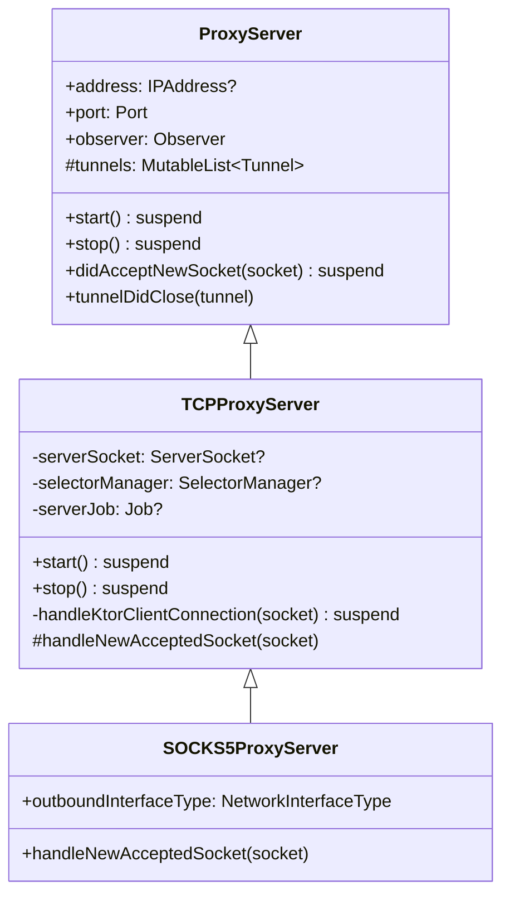
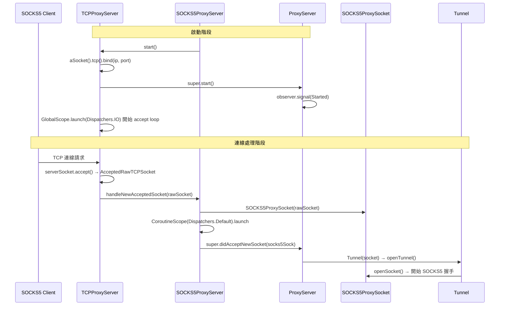
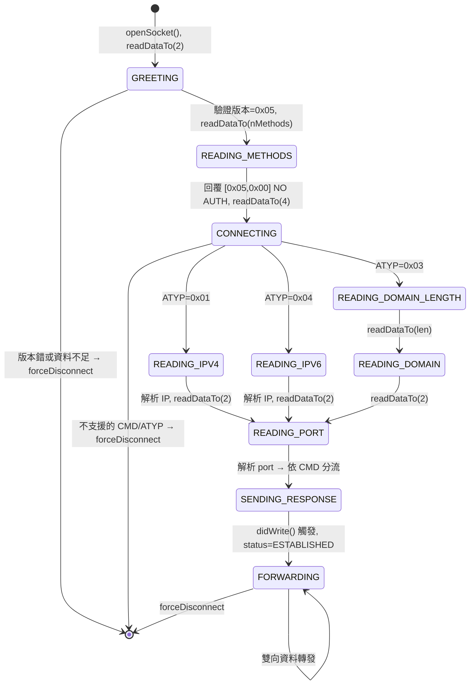
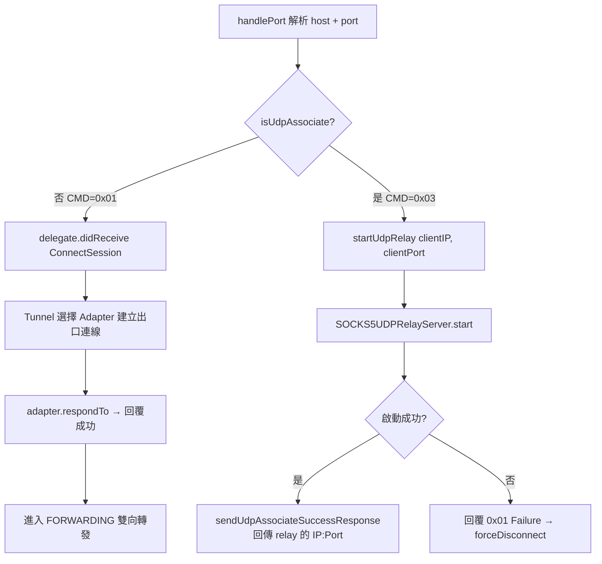
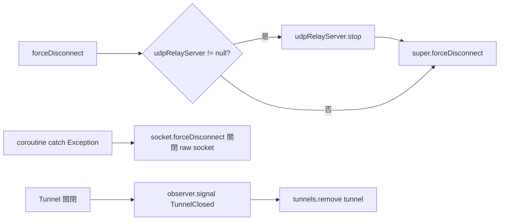

# SOCKS5ProxyServer 架構分析

## 類別繼承關係



---

## 主流程：TCP 連線建立與 Tunnel 開啟



---

## SOCKS5 握手狀態機



---

## CMD 分流：TCP CONNECT vs UDP ASSOCIATE



---

## 關閉 / 錯誤處理



---

## 各層職責對照

| 層次 | 類別 | 職責 |
|------|------|------|
| 基礎層 | `ProxyServer` | Tunnel 列表管理、生命週期、Observer 通知 |
| TCP 層 | `TCPProxyServer` | Ktor ServerSocket 綁定、accept loop |
| SOCKS5 協議層 | `SOCKS5ProxyServer` | 包裝成 `SOCKS5ProxySocket`，啟動 coroutine |
| 握手層 | `SOCKS5ProxySocket` | 狀態機驅動 SOCKS5 握手、TCP/UDP 分流 |
| UDP 層 | `SOCKS5UDPRelayServer` | UDP ASSOCIATE 封包轉發 |

---

## 架構問題與改進建議

### ✅ 設計做得好的地方

- 繼承層次清楚，職責分離明確
- SOCKS5 狀態機完整覆蓋協議流程
- `tunnels` list 使用 `Mutex` 保護，避免 race condition
- UDP Relay 使用單一統一 outbound socket，避免 `Dispatchers.IO` 耗盡

---

### ⚠️ 需要改進的問題

#### 🔴 高優先：Coroutine Scope 洩漏

```kotlin
// SOCKS5ProxyServer.kt
val scope = CoroutineScope(Dispatchers.Default)  // 孤兒 scope，無人持有
scope.launch { ... }
```

每次新連線都建立一個孤兒 scope，無法在連線關閉時 cancel，導致資源洩漏。

**建議**：改用 server 層級的 `SupervisorJob` scope：

```kotlin
// 在 SOCKS5ProxyServer 中宣告
private val serverScope = CoroutineScope(SupervisorJob() + Dispatchers.Default)

override fun handleNewAcceptedSocket(socket: RawTCPSocketProtocol) {
    val socks5ProxySocket = SOCKS5ProxySocket(socket)
    socks5ProxySocket.outboundInterfaceType = this.outboundInterfaceType
    serverScope.launch {
        try {
            super.didAcceptNewSocket(socks5ProxySocket)
        } catch (e: Exception) { ... }
    }
}

// 在 stop() 時取消
override suspend fun stop() {
    serverScope.cancel()
    super.stop()
}
```

---

#### 🟡 中優先：GlobalScope 濫用

```kotlin
// SOCKS5ProxySocket.kt & TCPProxyServer.kt
GlobalScope.launch(...)
```

`GlobalScope` 讓 coroutine 生命週期脫離結構化管理，難以追蹤和取消。

**建議**：注入或傳入有明確生命週期的 scope。

---

#### 🟡 中優先：`didBecomeReadyToForward` 雙重觸發

```kotlin
// ProxySocket.kt L103 - super.respondTo() 已呼叫
delegate?.get()?.didBecomeReadyToForward(this)

// SOCKS5ProxySocket.kt L93 - didWrite 的 SENDING_RESPONSE 又呼叫一次
delegate?.get()?.didBecomeReadyToForward(this)
```

**建議**：確認 `SOCKS5ProxySocket.respondTo` 覆寫後是否需要呼叫 `super`。若不呼叫 `super.respondTo()`，則去掉第一次觸發；若呼叫，則移除 `didWrite` 裡的第二次觸發。

---

#### 🟡 中優先：UDP 客戶端辨識條件 Operator Precedence Bug

```kotlin
// SOCKS5UDPRelayServer.kt L121-122
expectedClientAddress.presentation == "127.0.0.1" && sourceAddress.presentation == "::1"
// 上面這段 && 優先於 ||，可能造成非預期的條件組合
```

**建議**：加上顯式括號：

```kotlin
(expectedClientAddress.presentation == "127.0.0.1" && sourceAddress.presentation == "::1")
```

---

#### 🟠 低優先：Accept Loop 出錯後不重啟

```kotlin
// TCPProxyServer.kt
} catch (e: Exception) {
    if (e !is CancellationException) {
        logger.error(...)
        // ← loop 結束，整個 server 停止接受新連線
    }
}
```

任何非取消的異常都會永久終止 accept loop。

**建議**：加入 retry / 重啟機制：

```kotlin
while (isActive) {
    try {
        val clientSocket = serverSocket!!.accept()
        launch { handleKtorClientConnection(clientSocket) }
    } catch (e: CancellationException) {
        break
    } catch (e: Exception) {
        logger.error("Accept error, retrying: {}", e.message)
        delay(500) // 避免 tight loop
    }
}
```

---

### 優先度總覽

| 問題 | 影響 | 優先度 |
|---|---|---|
| 孤兒 CoroutineScope 洩漏 | 記憶體/資源洩漏 | 🔴 高 |
| GlobalScope 濫用 | 生命週期不可控 | 🟡 中 |
| `didBecomeReadyToForward` 雙重觸發 | 邏輯 bug | 🟡 中 |
| UDP 客戶端辨識邏輯 operator precedence | 潛在 bug | 🟡 中 |
| Accept Loop 不重啟 | server 單點故障 | 🟠 低-中 |
