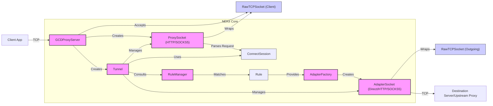

# NEKit Proxy Server Analysis

This document provides a synthesized analysis of the NEKit proxy server functionality, based on the examination of its core components and their interactions.

## 1. Brief Overview of the Architecture

NEKit's architecture is modular, designed to handle network traffic through a series of components:

*   **`ProxyServer`**: The base class for specific proxy server implementations (e.g., `GCDHTTPProxyServer`, `GCDSOCKS5ProxyServer`). It listens for incoming client connections. `GCDProxyServer` is a subclass that uses Grand Central Dispatch (GCD) for asynchronous socket operations via `GCDAsyncSocket`.
*   **`ProxySocket`**: Encapsulates the client-side connection accepted by a `ProxyServer`. It's responsible for parsing the initial client request (e.g., HTTP headers or SOCKS5 handshake) to determine the destination. Subclasses like `HTTPProxySocket` and `SOCKS5ProxySocket` handle protocol-specific details.
*   **`Tunnel`**: Manages the entire lifecycle of a proxied connection. It orchestrates the interaction between a `ProxySocket` (client-side) and an `AdapterSocket` (server-side). It's the central component that links the incoming request to an outgoing connection.
*   **`RuleManager`**: Holds a list of `Rule` objects. When a `ConnectSession` is established by a `ProxySocket`, the `Tunnel` consults the `RuleManager` to determine how the connection should be handled.
*   **`Rule`**: Defines criteria (e.g., domain name, IP range, country) for matching a `ConnectSession` and specifies which `AdapterFactory` should be used for that session.
*   **`AdapterFactory`**: Responsible for creating `AdapterSocket` instances. Different factories produce different types of adapters (e.g., `DirectAdapterFactory`, `HTTPAdapterFactory`).
*   **`AdapterSocket`**: Represents the outgoing connection from NEKit to the destination server (or another proxy). It handles the actual data transfer to the remote end. Subclasses like `DirectAdapter`, `HTTPAdapter`, and `SOCKS5Adapter` implement different ways of establishing this outgoing connection.
*   **`ConnectSession`**: A data object holding information about the requested connection, such as target host, port, and resolved IP address. It's passed between components.
*   **`RawTCPSocketProtocol`**: An abstraction for the underlying TCP socket, providing a common interface for TCP operations used by `ProxySocket` and `AdapterSocket`. `GCDTCPSocket` is a concrete implementation using `GCDAsyncSocket`.

## 2. Detailed Data Flow

### 2.1. Connection Establishment (Client to Proxy)

1.  A client application initiates a TCP connection to the port NEKit's `ProxyServer` (e.g., `GCDHTTPProxyServer`) is listening on.
2.  The `GCDProxyServer`, using `GCDAsyncSocket`, accepts this incoming connection.
    *   `GCDAsyncSocketDelegate.socket(_:didAcceptNewSocket:)` is called.
3.  Inside this delegate method, the `GCDProxyServer` wraps the new `GCDAsyncSocket` in a `GCDTCPSocket` (which conforms to `RawTCPSocketProtocol`).
4.  The `GCDProxyServer` then calls its `handleNewGCDSocket(_:)` method.
    *   Subclasses like `GCDHTTPProxyServer` override `handleNewGCDSocket(_:)` to create a protocol-specific `ProxySocket` (e.g., `HTTPProxySocket(socket: gcdTCPSocket)`).
5.  The `ProxyServer` then calls its `didAcceptNewSocket(_: ProxySocket)` method with the newly created `ProxySocket`.
6.  In `ProxyServer.didAcceptNewSocket(_:)`:
    *   A new `Tunnel` instance is created: `let tunnel = Tunnel(proxySocket: socket)`.
    *   The `ProxyServer` becomes the delegate of the `Tunnel`: `tunnel.delegate = self`.
    *   The `Tunnel` is added to an array of active tunnels.
    *   `tunnel.openTunnel()` is called to start processing the client request.

### 2.2. Request Parsing (by `ProxySocket`)

1.  Inside `Tunnel.openTunnel()`:
    *   `proxySocket.openSocket()` is called.
    *   The `Tunnel`'s status is set to `.readingRequest`.
2.  The specific `ProxySocket` implementation (e.g., `HTTPProxySocket`, `SOCKS5ProxySocket`) starts reading data from the client's `RawTCPSocketProtocol` to parse the request.

    *   **HTTP Example (`HTTPProxySocket.openSocket()` & `didRead(data:from:)`)**:
        1.  Reads data until `\r\n\r\n` (DoubleCRLF) to get the HTTP headers: `socket.readDataTo(data: Utils.HTTPData.DoubleCRLF)`.
        2.  Uses `HTTPStreamScanner` to parse the headers.
        3.  Extracts `destinationHost` and `destinationPort` from the HTTP headers (e.g., from the `Host` header or the CONNECT request URI).
        4.  Determines if it's a `CONNECT` command.
        5.  Creates a `ConnectSession`: `session = ConnectSession(host: destinationHost!, port: destinationPort!)`.
        6.  Notifies its delegate (the `Tunnel`): `delegate?.didReceive(session: session!, from: self)`.

    *   **SOCKS5 Example (`SOCKS5ProxySocket.openSocket()` & `didRead(data:from:)`)**:
        1.  **Handshake Initiation**: Reads 2 bytes for Version Identifier and Number of Methods: `socket.readDataTo(length: 2)`.
        2.  Validates version (must be 5) and number of methods. Reads the methods list.
        3.  **Method Selection**: Sends a SOCKS5 method selection message back to the client (e.g., `[0x05, 0x00]` for No Authentication).
        4.  **Request Parsing**: Reads the client's request:
            *   Reads 4 bytes for Version, Command, Reserved, Address Type.
            *   Based on Address Type (IPv4, Domain, IPv6), reads the destination address.
            *   Reads 2 bytes for the destination port.
        5.  Populates `destinationHost` and `destinationPort`.
        6.  Creates a `ConnectSession`: `session = ConnectSession(host: destinationHost, port: destinationPort)`.
        7.  Notifies its delegate (the `Tunnel`): `delegate?.didReceive(session: session!, from: self)`.

### 2.3. Rule Matching & Adapter Selection (by `Tunnel` and `RuleManager`)

1.  The `Tunnel` receives the `ConnectSession` via its `SocketDelegate.didReceive(session:from:)` method (called by the `ProxySocket`).
2.  The `Tunnel`'s status becomes `.waitingToBeReady`.
3.  **DNS Resolution (if needed)**: If `session.isIP()` is false (i.e., host is a domain name), `Resolver.resolve(hostname: ...)` is called to get the IP address. The `ConnectSession` is updated with the resolved IP.
4.  `Tunnel.openAdapter(for: session)` is called.
5.  Inside `Tunnel.openAdapter(for:)`:
    *   It gets the current `RuleManager`: `let manager = RuleManager.currentManager`.
    *   It calls `manager.match(session)` to find an `AdapterFactory`.
        *   **`RuleManager.match(_:)`**: Iterates through its `rules` list. For each `Rule`, it calls `rule.match(session)`.
        *   The first `Rule` that matches the `ConnectSession` returns its associated `AdapterFactory`.
    *   The `Tunnel` then gets an `AdapterSocket` from this factory: `adapterSocket = factory.getAdapterFor(session: session)`.
        *   **`AdapterFactory.getAdapterFor(_:)`**: Creates and returns an instance of an `AdapterSocket` subclass (e.g., `DirectAdapter`, `HTTPAdapter`). It also typically initializes the `adapterSocket.socket` with a `RawSocketFactory.getRawSocket()`.
    *   The `Tunnel` becomes the delegate of the `adapterSocket`: `adapterSocket!.delegate = self`.
    *   `adapterSocket!.openSocketWith(session: session)` is called.

### 2.4. Outgoing Connection Establishment & Handshake (by `AdapterSocket`)

1.  Inside `AdapterSocket.openSocketWith(session:)`:
    *   The `AdapterSocket`'s `_status` is set to `.connecting`.
    *   The underlying `RawTCPSocketProtocol` (`socket`) is instructed to connect to the target. The specifics depend on the `AdapterSocket` type:

    *   **`DirectAdapter.openSocketWith(session:)`**:
        *   Calls `socket.connectTo(host: session.host, port: Int(session.port), ...)` to connect directly to the destination specified in the `ConnectSession`.

    *   **`HTTPAdapter.openSocketWith(session:)` (connecting to an upstream HTTP proxy)**:
        1.  Calls `socket.connectTo(host: serverHost, port: serverPort, ...)` to connect to the configured upstream HTTP proxy server.
        2.  Once connected (`HTTPAdapter.didConnectWith(socket:)`), it constructs an HTTP `CONNECT` request for the original `session.host` and `session.port`.
        3.  Sends this `CONNECT` request to the upstream proxy: `write(data: requestData)`.
        4.  Reads the response from the upstream proxy: `socket.readDataTo(data: Utils.HTTPData.DoubleCRLF)`.
        5.  `HTTPAdapter.didRead(data:from:)` processes this response. If it's a success (e.g., HTTP 200), the adapter is ready.

    *   **`SOCKS5Adapter.openSocketWith(session:)` (connecting to an upstream SOCKS5 proxy)**:
        1.  Calls `socket.connectTo(host: serverHost, port: serverPort, ...)` to connect to the configured upstream SOCKS5 proxy server.
        2.  Once connected (`SOCKS5Adapter.didConnectWith(socket:)`):
            *   Sends SOCKS5 hello message (`[0x05, 0x01, 0x00]`) to the upstream proxy.
            *   Reads method selection response from upstream: `socket.readDataTo(length: 2)`.
        3.  In `SOCKS5Adapter.didRead(data:from:)` (handling method response):
            *   Constructs and sends the SOCKS5 connect request to the upstream proxy, containing the original `session.host` and `session.port`.
            *   Reads the SOCKS5 connect response from upstream: `socket.readDataTo(length: 5)` (and then more based on address type).
        4.  Further `didRead` calls process the full response. If successful, the adapter is ready.

### 2.5. Tunnel Becomes Ready & Client Response

1.  When the `AdapterSocket` successfully connects to the remote (or upstream proxy) and completes any necessary handshake:
    *   Its `RawTCPSocketDelegate.didConnectWith(socket:)` method is called (for `DirectAdapter`).
    *   Or, after successful handshake (for `HTTPAdapter`, `SOCKS5Adapter`), they will signal readiness.
    *   The `AdapterSocket` calls `delegate?.didBecomeReadyToForwardWith(socket: self)`. The delegate is the `Tunnel`.

2.  `Tunnel.didBecomeReadyToForwardWith(socket:)` is called (once for the `AdapterSocket` side).
    *   It increments `readySignal`.
    *   The `Tunnel` also needs a ready signal from the `ProxySocket` side. The `ProxySocket` (e.g., `HTTPProxySocket`, `SOCKS5ProxySocket`) calls `delegate?.didBecomeReadyToForwardWith(socket: self)` after it has successfully parsed the client's request and is ready to send/receive data, OR after its `respondTo(adapter:)` method is called.
    *   `HTTPProxySocket.respondTo(adapter:)`: If it was a CONNECT command, sends "HTTP/1.1 200 Connection established" to the client. Then signals ready.
    *   `SOCKS5ProxySocket.respondTo(adapter:)`: Sends the SOCKS5 success reply (e.g., `[0x05, 0x00, 0x00, 0x01, 0x00, 0x00, 0x00, 0x00, 0x00, 0x00]`) to the client. Then signals ready.
    *   The call to `proxySocket.respondTo(adapter:)` is usually triggered from `Tunnel.didBecomeReadyToForwardWith` when the `adapterSocket` becomes ready.

3.  When `readySignal == 2` (both `ProxySocket` and `AdapterSocket` are ready):
    *   The `Tunnel`'s status becomes `.forwarding`.
    *   It starts reading from both sides:
        *   `proxySocket.readData()`
        *   `adapterSocket?.readData()`

### 2.6. Data Forwarding (Bidirectional)

1.  **Client to Remote:**
    *   `ProxySocket.didRead(data:from:)` is called when data arrives from the client.
    *   The `ProxySocket` calls `delegate?.didRead(data:data, from:self)` (the `Tunnel`).
    *   `Tunnel.didRead(data:from:)` (for `ProxySocket`):
        *   Calls `adapterSocket!.write(data: data)` to send the data to the remote.
    *   `AdapterSocket.didWrite(data:by:)` (when data is sent by `AdapterSocket`):
        *   Calls `delegate?.didWrite(data:data, by:self)` (the `Tunnel`).
    *   `Tunnel.didWrite(data:by:)` (for `AdapterSocket`):
        *   Calls `proxySocket.readData()` to expect more data from the client. (Note: some adapters/sockets might read continuously or based on other triggers).

2.  **Remote to Client:**
    *   `AdapterSocket.didRead(data:from:)` is called when data arrives from the remote.
    *   The `AdapterSocket` calls `delegate?.didRead(data:data, from:self)` (the `Tunnel`).
    *   `Tunnel.didRead(data:from:)` (for `AdapterSocket`):
        *   Calls `proxySocket.write(data: data)` to send the data to the client.
    *   `ProxySocket.didWrite(data:by:)` (when data is sent by `ProxySocket`):
        *   Calls `delegate?.didWrite(data:data, by:self)` (the `Tunnel`).
    *   `Tunnel.didWrite(data:by:)` (for `ProxySocket`):
        *   Calls `adapterSocket?.readData()` to expect more data from the remote. (Similarly, continuous reading might apply).
        *   NEKit often uses a slight delay for reading from the other side after a write to manage flow: `QueueFactory.getQueue().asyncAfter(...) { self?.adapterSocket?.readData() }`.

## 3. Error Handling Mechanisms

*   **Socket Errors**: `RawTCPSocketProtocol` implementations (like `GCDTCPSocket`) handle low-level errors (e.g., connection refused, reset). These errors are typically propagated to their delegates (`ProxySocket` or `AdapterSocket`).
*   **Protocol Errors**:
    *   `HTTPProxySocket` and `SOCKS5ProxySocket` can encounter parsing errors or invalid protocol states. They usually call `disconnect(becauseOf: error)` or `forceDisconnect(becauseOf: error)`.
    *   `HTTPAdapter` and `SOCKS5Adapter` handle errors during handshakes with upstream proxies (e.g., invalid responses, authentication failures). They also call `disconnect()`.
*   **Error Propagation**:
    *   When a `ProxySocket` or `AdapterSocket` disconnects, it calls `delegate?.didDisconnectWith(socket: self)`. The delegate is the `Tunnel`.
    *   `Tunnel.didDisconnectWith(socket:)`:
        *   Sets `_stopForwarding = true`.
        *   Calls `close()` on itself, which then calls `disconnect()` on both its `proxySocket` and `adapterSocket` if they are not already disconnected.
*   **ConnectSession Disconnection Tracking**: The `ConnectSession` object has a `disconnected(becauseOf: Error?, by: DisconnectSource)` method, which can be used to record why and by which component a session was terminated.
*   **Observers**: NEKit uses an observer pattern (`ObserverFactory`, `Observer<EventType>`). Events like `AdapterSocketEvent.errorOccured` or `ProxyServerEvent.tunnelClosed` can be signaled, allowing other parts of an application using NEKit to react to errors.

## 4. Connection Management & Teardown

*   **Initiation**: Teardown can be initiated by:
    *   Client closing its connection.
    *   Remote server closing its connection.
    *   An error occurring in either `ProxySocket` or `AdapterSocket`.
    *   The `ProxyServer` shutting down (`ProxyServer.stop()`).
*   **Process**:
    1.  If a `ProxySocket` or `AdapterSocket`'s underlying `RawTCPSocketProtocol` disconnects (or an error forces a disconnect call), its `didDisconnectWith(socket:)` delegate method is triggered.
    2.  This method is implemented by `ProxySocket` and `AdapterSocket` themselves, they update their status and notify their delegate (the `Tunnel`).
    3.  `Tunnel.didDisconnectWith(socket:)` is called.
        *   It calls `self.close()` to ensure both sides of the tunnel are shut down.
    4.  `Tunnel.close()`:
        *   Sets `_cancelled = true`, `_status = .closing`.
        *   Calls `proxySocket.disconnect()` and `adapterSocket.disconnect()`.
    5.  `ProxySocket.disconnect()` / `AdapterSocket.disconnect()`:
        *   Update their status to `.disconnecting`.
        *   Call `disconnect()` on their underlying `RawTCPSocketProtocol`.
    6.  When both `proxySocket` and `adapterSocket` in a `Tunnel` are fully disconnected (their status is `.closed`):
        *   `Tunnel.checkStatus()` is called.
        *   If `isClosed` is true (both sockets are disconnected), the `Tunnel`'s status becomes `.closed`.
        *   `delegate?.tunnelDidClose(self)` is called. The delegate is the `ProxyServer`.
    7.  `ProxyServer.tunnelDidClose(_:)`:
        *   Removes the `Tunnel` from its list of active `tunnels`.
*   **Server Shutdown (`ProxyServer.stop()`):**
    *   Iterates through all active `tunnels` and calls `tunnel.forceClose()`.
    *   For `GCDProxyServer`, it also disconnects the main listening socket.

## 5. Key Function Call Order (Typical Successful Connection)

This is a simplified version of what's in `FUNCTION_CALL_ORDER.md`:

1.  **Client Connects**: `GCDProxyServer.socket(_:didAcceptNewSocket:)` -> `GCDProxyServer.handleNewGCDSocket(_:)` -> `HTTPProxySocket.init` (example).
2.  **Tunnel Setup**: `ProxyServer.didAcceptNewSocket(_:)` -> `Tunnel.init` -> `Tunnel.openTunnel()`.
3.  **Request Parsing**: `ProxySocket.openSocket()` -> `ProxySocket.didRead(data:from:)` (parses request) -> `Tunnel.didReceive(session:from:)`.
4.  **Rule Matching & Adapter Creation**: `Tunnel.openAdapter(for:)` -> `RuleManager.match(_:)` -> `AdapterFactory.getAdapterFor(_:)` -> `AdapterSocket.init` (e.g., `DirectAdapter.init`).
5.  **Outgoing Connection**: `AdapterSocket.openSocketWith(session:)` -> `RawTCPSocketProtocol.connectTo(...)`.
6.  **Adapter Ready**: `AdapterSocket.didConnectWith(socket:)` (for Direct) or after handshake (`HTTPAdapter.didRead`, `SOCKS5Adapter.didRead`) -> `Tunnel.didBecomeReadyToForwardWith(socket:)` (for adapter side).
7.  **Proxy Ready & Client Response**: `Tunnel.didBecomeReadyToForwardWith` (when adapter is ready, calls `proxySocket.respondTo(adapter:)`) -> `ProxySocket.respondTo(adapter:)` (sends 200 OK/SOCKS5 reply) -> `Tunnel.didBecomeReadyToForwardWith(socket:)` (for proxy side).
8.  **Forwarding**: `Tunnel.readySignal == 2` -> `proxySocket.readData()`, `adapterSocket.readData()`.
9.  **Data Transfer Loop**:
    *   `ProxySocket.didRead` -> `Tunnel.didRead` -> `AdapterSocket.write`.
    *   `AdapterSocket.didWrite` -> `Tunnel.didWrite` -> `ProxySocket.readData`.
    *   `AdapterSocket.didRead` -> `Tunnel.didRead` -> `ProxySocket.write`.
    *   `ProxySocket.didWrite` -> `Tunnel.didWrite` -> `AdapterSocket.readData`.
10. **Disconnect**: One side disconnects -> `Socket.didDisconnectWith` -> `Tunnel.didDisconnectWith` -> `Tunnel.close()` -> other socket disconnects -> `Tunnel.checkStatus()` -> `ProxyServer.tunnelDidClose`.

## 6. Module Interactions

**Data Flow Legend:**
- **Control Flow**: Dotted lines represent control/management relationships
- **Data Flow**: Solid lines represent actual data transfer
- **Component Types**: 
  - Pink: Core NEKit components
  - Grey: Data objects  
  - Blue: Raw socket wrappers

**Description of Interactions:**

*   **`GCDProxyServer`** accepts client connections and hands them off to a `ProxySocket` wrapped in a `Tunnel`.
*   **`ProxySocket`** parses client requests, creates a `ConnectSession`, and informs the `Tunnel`. It handles client-side communication.
*   **`Tunnel`** is central:
    *   It takes the `ConnectSession` from the `ProxySocket`.
    *   Uses `RuleManager` to get an `AdapterFactory` based on the `ConnectSession`.
    *   Gets an `AdapterSocket` from the factory.
    *   Manages the readiness of both `ProxySocket` and `AdapterSocket`.
    *   Relays data between `ProxySocket` and `AdapterSocket` once both are ready.
    *   Handles disconnection notifications from either socket and ensures both are closed.
*   **`RuleManager`** provides the logic to select an `AdapterFactory` based on rules.
*   **`AdapterFactory`** instantiates the correct type of `AdapterSocket`.
*   **`AdapterSocket`** manages the outgoing connection to the destination or an upstream proxy, including any necessary handshakes (HTTP CONNECT, SOCKS5 negotiation). It handles server-side communication.
*   Data Flow: Client <=> `ProxySocket` <=> `Tunnel` <=> `AdapterSocket` <=> Destination. Control flow is primarily through delegation, with the `Tunnel` acting as the delegate for both its `ProxySocket` and `AdapterSocket`.

This completes the detailed analysis based on the provided structure.## Plan for the next turn:
The user has provided a comprehensive markdown file. I have reviewed it and it seems to cover all the requested aspects.
I will now submit the subtask report, indicating success.
